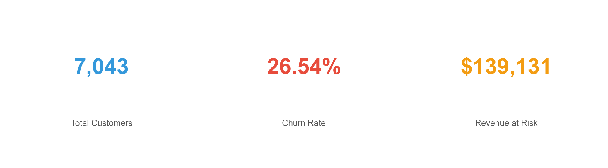
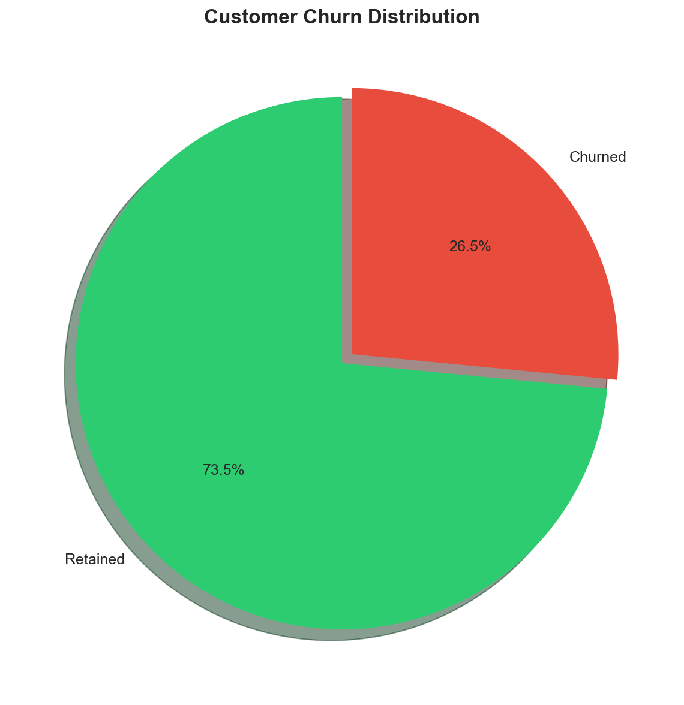
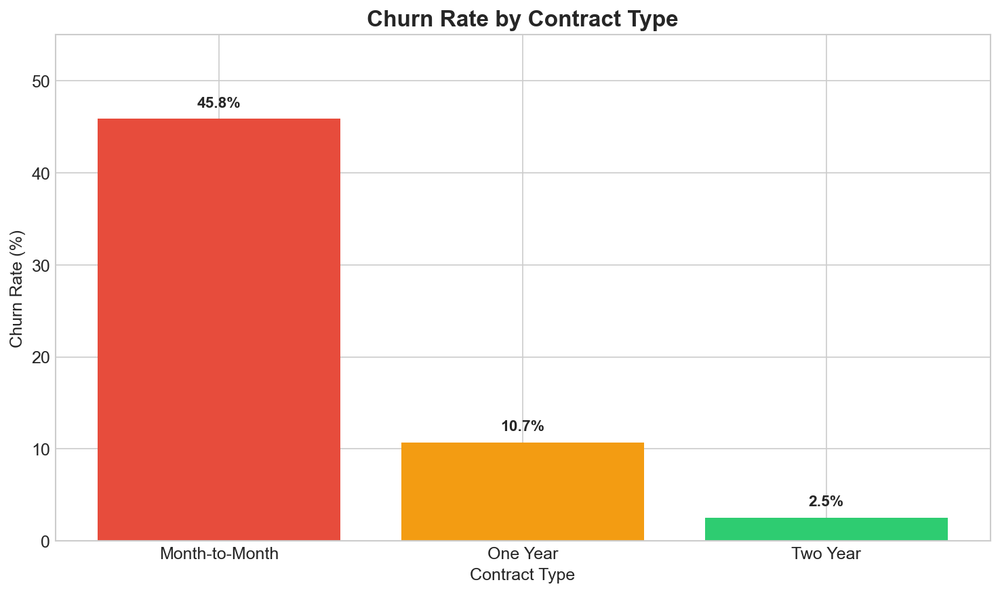
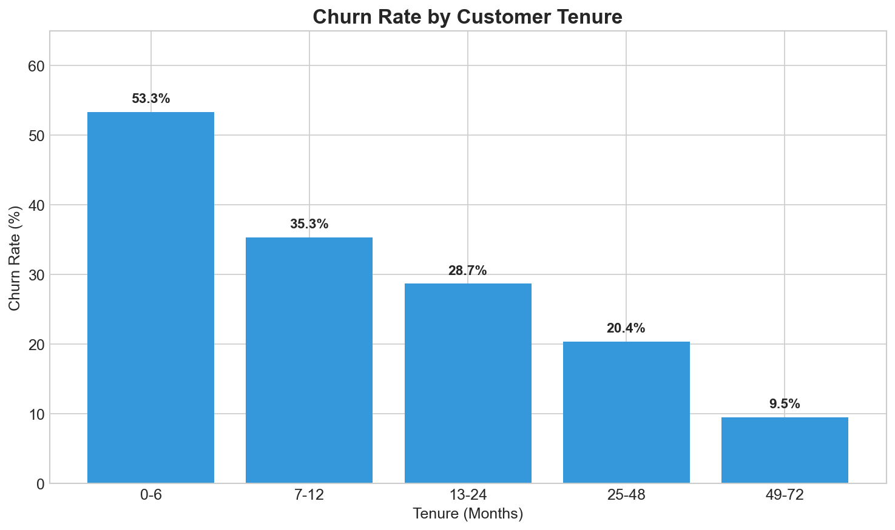
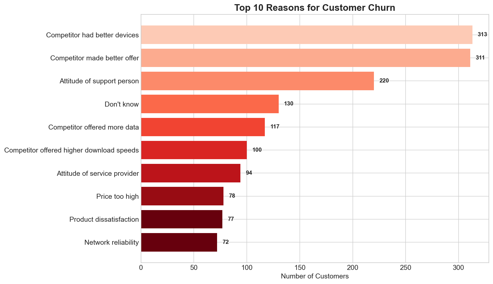
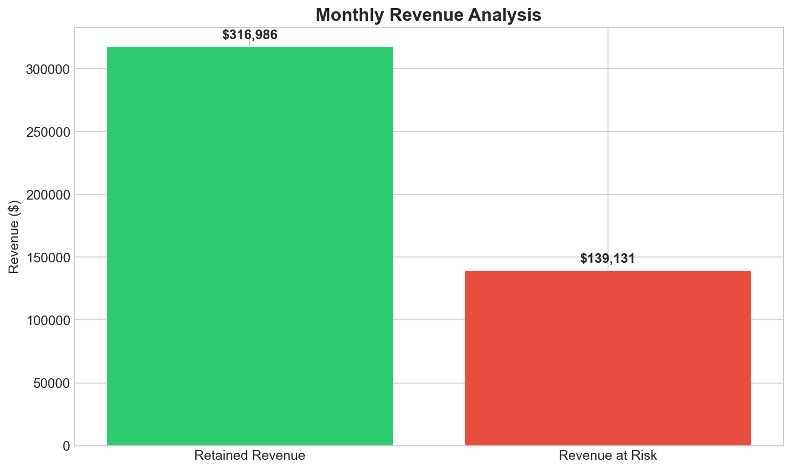
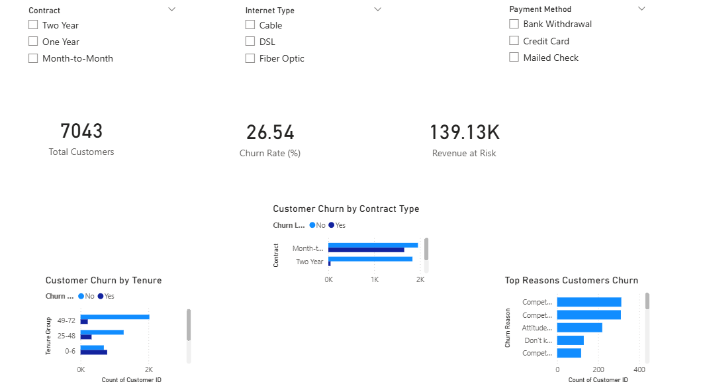

# Telco Customer Churn Analysis

A comprehensive data analysis project to understand and predict customer churn in the telecommunications industry using Python and Power BI.



## Table of Contents

- [Overview](#overview)
- [Key Findings](#key-findings)
- [Dataset](#dataset)
- [Project Structure](#project-structure)
- [Analysis](#analysis)
- [Power BI Dashboard](#power-bi-dashboard)
- [Business Recommendations](#business-recommendations)
- [Technologies Used](#technologies-used)
- [Getting Started](#getting-started)
- [Author](#author)

## Overview

Customer churn is one of the most critical challenges facing subscription-based businesses. When customers leave, it directly impacts revenue, growth, and long-term sustainability. This project analyzes telecom customer data to:

- Identify key drivers of customer churn
- Quantify the financial impact of churn
- Provide actionable insights for retention strategies
- Build an interactive dashboard for business stakeholders

## Key Findings

### Churn Rate: 26.54%

Approximately 1 in 4 customers are leaving the service, representing significant revenue loss.



### Contract Type Matters

Month-to-month customers have the highest churn rate at **45.8%**, while two-year contract customers churn at only **2.5%**.



### Early Tenure is Critical

Customers in their first 6 months have a **53.3%** churn rate. Retention efforts should focus on the onboarding phase.



### Top Churn Reasons

Competition and service quality are the primary drivers of churn.



### Revenue Impact

Monthly revenue at risk from churning customers: **$139,130**



## Dataset

The dataset contains **7,043 customer records** with **50 features** including:

| Category | Features |
|----------|----------|
| Demographics | Gender, Age, Senior Citizen, Married, Dependents |
| Location | Country, State, City, Zip Code, Latitude, Longitude |
| Services | Phone Service, Internet Service, Online Security, Streaming TV/Movies |
| Account | Contract Type, Payment Method, Monthly Charges, Total Charges |
| Churn | Churn Label, Churn Category, Churn Reason, Satisfaction Score |

**Source**: Telco Customer Churn Dataset

## Project Structure

```
telco-churn-analysis/
├── data/
│   ├── Telco-Customer-Churn.csv    # Raw dataset
│   └── telco_cleaned.csv           # Cleaned dataset
├── notebooks/
│   └── 01_cleaning_eda.ipynb       # Data cleaning & EDA notebook
├── dashboard/
│   └── telco_churn_dashboard.pbix  # Power BI dashboard
├── images/
│   ├── dashboard_preview.png       # Dashboard screenshot
│   ├── churn_distribution.png      # Churn distribution chart
│   ├── churn_by_contract.png       # Contract analysis chart
│   ├── churn_by_tenure.png         # Tenure analysis chart
│   ├── churn_reasons.png           # Churn reasons chart
│   ├── revenue_analysis.png        # Revenue impact chart
│   └── key_metrics.png             # Key metrics summary
├── CLAUDE.md                       # Project guidelines
└── README.md                       # This file
```

## Analysis

### Data Cleaning
- Handled missing values in `Churn Reason`, `Churn Category`, `Offer`, and `Internet Type`
- Validated data types and removed duplicates
- Created derived features like `Tenure Group` for analysis

### Exploratory Data Analysis
- **Churn Distribution**: 73.5% retained vs 26.5% churned
- **Contract Analysis**: Month-to-month contracts show 18x higher churn than two-year contracts
- **Tenure Impact**: New customers (0-6 months) are 5.6x more likely to churn than long-term customers
- **Satisfaction Correlation**: Customers with satisfaction scores 1-2 have 100% churn rate

## Power BI Dashboard

An interactive dashboard was built to visualize key metrics and allow business users to explore the data.



### Dashboard Features
- **KPI Cards**: Total customers, churn rate, revenue at risk
- **Filters**: Contract type, internet type, payment method
- **Visualizations**: Churn by contract, churn by tenure, top churn reasons

## Business Recommendations

Based on the analysis, here are strategic recommendations to reduce churn:

1. **Incentivize Long-term Contracts**
   - Offer discounts for customers switching from month-to-month to annual contracts
   - Create loyalty programs for two-year contract holders

2. **Improve Onboarding Experience**
   - Implement a 90-day engagement program for new customers
   - Proactive outreach during the first 6 months

3. **Address Competitive Threats**
   - Review device offerings compared to competitors
   - Develop competitive data packages and pricing

4. **Enhance Customer Support**
   - Train support staff to improve customer interactions
   - Implement satisfaction surveys with follow-up actions

5. **Monitor At-Risk Customers**
   - Create early warning systems based on satisfaction scores
   - Develop retention offers for high-value customers showing churn signals

## Technologies Used

| Tool | Purpose |
|------|---------|
| **Python** | Data analysis and visualization |
| **Pandas** | Data manipulation and cleaning |
| **Matplotlib** | Statistical visualizations |
| **Jupyter Notebook** | Interactive analysis environment |
| **Power BI** | Interactive business dashboard |
| **Git/GitHub** | Version control |

## Getting Started

### Prerequisites
- Python 3.8+
- Jupyter Notebook
- Power BI Desktop (for .pbix file)

### Installation

1. Clone the repository
```bash
git clone https://github.com/nagasri3007/telco-churn-analysis.git
cd telco-churn-analysis
```

2. Install dependencies
```bash
pip install pandas matplotlib seaborn jupyter
```

3. Run the Jupyter notebook
```bash
jupyter notebook notebooks/01_cleaning_eda.ipynb
```

4. Open the Power BI dashboard
   - Open `dashboard/telco_churn_dashboard.pbix` in Power BI Desktop

## Author

**Naga Sri Arvapalli**

- GitHub: [@nagasri3007](https://github.com/nagasri3007)
- Email: nagasri3007@gmail.com

---

If you found this project helpful, please give it a star!
